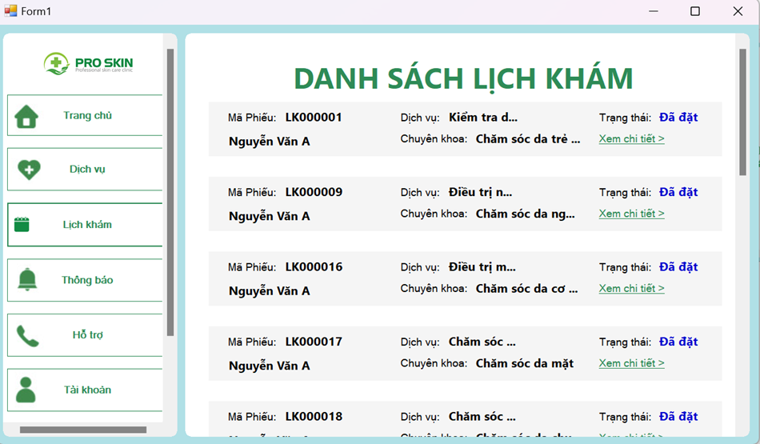
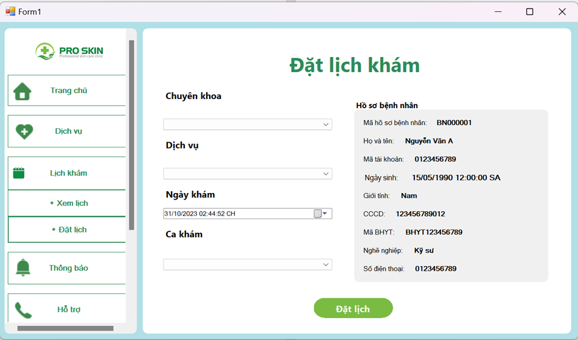
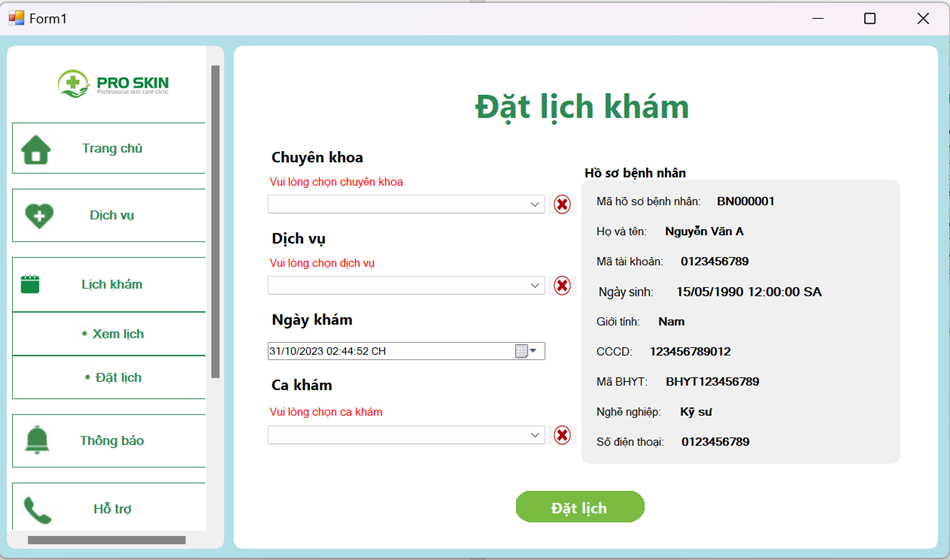
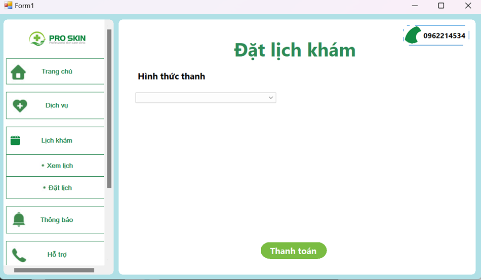
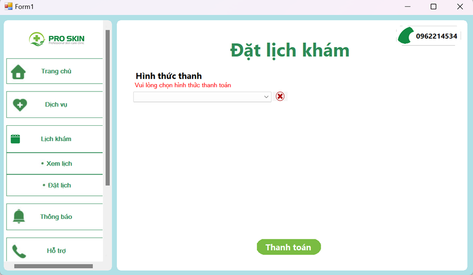
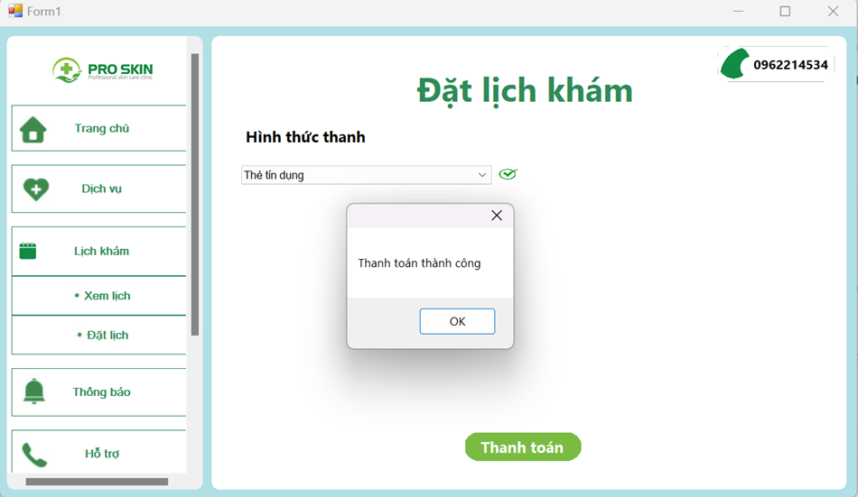
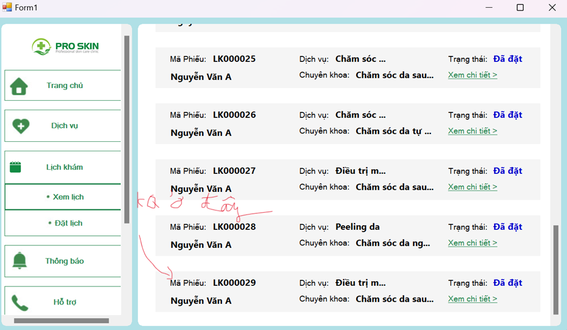

<h1>TÀI LIỆU HƯỚNG DẪN SỬ DỤNG</h1>
<h1>ĐẶT LỊCH VÀ XEM LỊCH KHÁM</h1>

<b>Phần 1:</b> Xem lịch khám

<b>Bước 1:</b> Chọn vào phần lịch khám

   

<b>Bước 2:</b> Chọn xem lịch khám

   

<b>Bước 3:</b> Một danh sách lịch khám mà mình đã đặt trước đó sẽ hiện ra

   

<b>Phần 2:</b> Đặt lịch khám

<b>Bước 1:</b> Chọn vào đặt lịch

   

<b>Bước 2:</b> Điền vào các trường thông tin của đặt lịch. Bên cạnh đó hồ sơ bệnh nhân mà ta đăng ký trước đó sẽ hiện ra. Nếu các trường thông tin bỏ trống chúng sẽ phát cảnh báo

  
   

<b>Bước 3:</b> Sau khi chọn các trường thông tin ta bấm vào nút đặt lịch và sẽ tới trang thanh toán. Nếu chúng ta không chọn hình thức thanh toán mà ấn thanh toán hệ thống sẽ phát cảnh báo

  
   

<b>Bước 4:</b> Sau khi chọn vào hình thức thanh toán và nhấn vào nút thanh toán nếu Thành công một hộp thoại sẽ hiện ra

   

<b>Bước 5:</b> Ta chỉ cần quay trở lại xem lịch để xem lịch mà chúng ta đã đặt

   