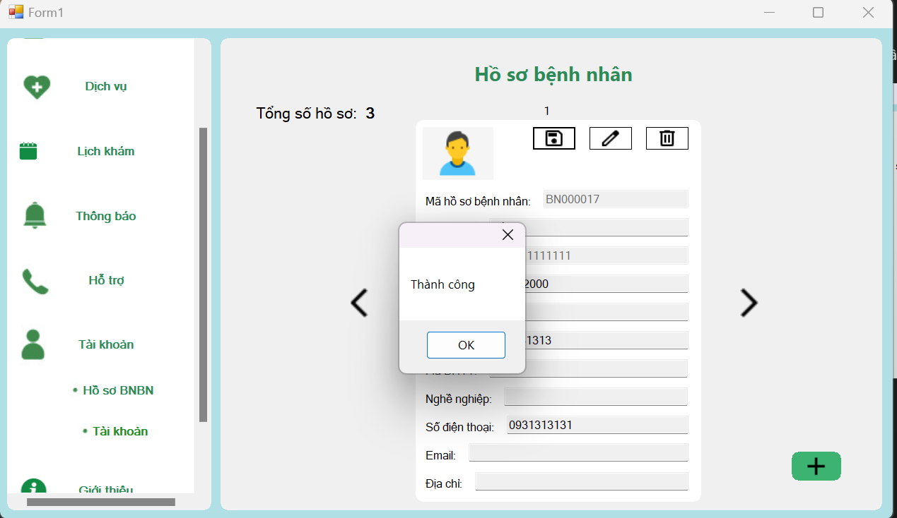

<!-- Tài liệu hướng dẫn sử dụng V2 -->
<h1>TÀI LIỆU HƯỚNG DẪN SỬ DỤNG V2</h1>
<h2>ĐẶT LỊCH KHÁM, XEM LỊCH KHÁM, ĐĂNG KÝ HỒ SƠ BỆNH NHÂN, XEM HỒ SƠ BỆNH NHÂN</h2>

<b>Phần 1:</b> Đặt lịch khám và xem lịch khám

<b>Bước 1:</b> Chọn vào phần lịch khám

   

<b>Bước 2:</b> Chọn vào phần đặt lịch

   

<b>Bước 3:</b> Nếu đã có hồ sơ bệnh nhân thì giao diện trong như thế này

   

<b>Bước 4:</b> Sau khi đã điền đầy đủ thông tin và <b>đã chọn</b> hồ sơ bệnh nhân tương ứng ta bấm vào đặt lịch. Trong trường hợp ta cố tình không điền thông tin mà bấm vào đặt lịch thì các cảnh báo sẽ hiển thị

   
   

<b>Bước 5:</b> Trong phần hình thức thanh toán ta chọn một hình thức thanh toán tương ứng rồi sau đó bấm vào nút thanh toán một hộp thoại thành công sẽ hiện ra, nếu ta cố tình bỏ trống ô hình thức thanh toán một cảnh báo sẽ được hiển thị

   
   
   

<b>Bước 6:</b> Sau khi đã thanh toán xong ta có thể bấm vào xem lịch để thấy danh sách lịch mà ta đã đặt. Trong trường hợp lúc thanh toán mà người đặt chưa thanh toán (có thể là thoát trang thanh toán trong lúc chưa thanh toán) thì dữ liệu lịch khám tại thời điểm đó sẽ được cập nhật là chưa thanh toán

   
   
   

<b>Bước 7:</b> Để xem chi tiết về lịch khám ta bấm vào xem chi tiết, lúc này trang xem chi tiết sẽ hiện ra. Trong trường hợp muốn quay về ta chỉ cần mũi tên quay về lập tức ta sẽ quay về trang xem lịch khám

   
   
   
   

<b>Phần 2:</b> Đăng ký hồ sơ bệnh nhân

<b>Bước 1:</b> Chọn vào phần lịch khám

   

<b>Bước 2:</b> Chọn vào phần đặt lịch. Trong trường hợp mà tài khoản chưa có dù chỉ 1 hồ sơ bệnh nhân thì giao diện đăng ký hồ sơ bệnh nhân sẽ hiện ra

   
   

<b>Bước 3:</b> Ta sẽ điền vào các trường thông tin trong hồ sơ bệnh nhân, sau khi điền xong ta cần có thể bấm vào nút lưu hồ sơ nếu thành công một hộp thoại sẽ hiện ra. Nếu người dùng bỏ trống hoặc điền sai theo format của trường thì các cảnh báo sẽ hiển thị  
<i>Lưu ý: * là các trường bắt buộc không được bỏ trống, các trường khác chấp nhận bỏ trống</i>

   
   
   

<b>Bước 4:</b> Sau đó ta bấm vào tài khoản -> Hồ sơ bệnh nhân. Tại đây ta có thể xem, xóa, sửa hồ sơ của mình (hình ảnh của hồ sơ sẽ thay đổi dựa vào tuổi và giới tính của người trong hồ sơ)

   
   

Trong hình là tổng số hồ sơ mà ta đã tạo, số ở phía trên đầu hồ sơ là số thứ tự của hồ sơ

<b>Bước 5:</b> Để xem hồ sơ theo thứ tự tăng dần ta bấm vào mũi tên bên phải và ngược lại

   
   

<b>Bước 6:</b> Để tạo hồ sơ bệnh nhân mới ta bấm vào nút + phía bên dưới lập tức ta sẽ quay về giao diện đăng ký hồ sơ bệnh nhân

   
   

<b>Bước 7:</b> Để chỉnh sửa hồ sơ bệnh nhân ta bấm vào biểu tượng edit lập tức các ô dữ liệu sẽ cho phép ta edit và nút save sẽ hiện ra nhưng nó đã bị khóa, nó chỉ mở khi tất cả dữ liệu chỉnh sửa là hợp lệ. Trong trường hợp dữ liệu chỉnh sửa không hợp lệ dòng chữ sẽ biến thành màu đỏ

   
   
   

<b>Bước 8:</b> Trong trường hợp dữ liệu đầu vào hợp lệ ta bấm vào biểu tượng save sau đó hộp thoại thành công sẽ được hiển thị

   
   

<b>Bước 9:</b> Quay trở lại tài khoản -> hồ sơ bệnh nhân ta thấy dữ liệu đã được cập nhật

   

<b>Bước 10:</b> Để xóa hồ sơ bệnh nhân ta chỉ việc bấm vào biểu tượng delete

   

<b>Bước 11:</b> Lúc này sẽ có một hộp thoại cảnh báo người dùng về việc xóa hồ sơ bệnh nhân, ta chọn Yes nếu đồng ý xóa

   

<b>Bước 12:</b> Sau khi xóa dữ liệu sẽ được cập nhật và người dùng có thể nhận ra số lượng hồ sơ đã giảm đi 1 và dữ liệu về hồ sơ đó cũng đã biến mất

   

<!-- Tài liệu hướng dẫn sử dụng  V1 -->
    <h1>TÀI LIỆU HƯỚNG DẪN SỬ DỤNG V1</h1>
<h2>ĐẶT LỊCH VÀ XEM LỊCH KHÁM</h2>

<b>Phần 1:</b> Xem lịch khám

<b>Bước 1:</b> Chọn vào phần lịch khám

   

<b>Bước 2:</b> Chọn xem lịch khám

   

<b>Bước 3:</b> Một danh sách lịch khám mà mình đã đặt trước đó sẽ hiện ra

   

<b>Phần 2:</b> Đặt lịch khám

<b>Bước 1:</b> Chọn vào đặt lịch

   

<b>Bước 2:</b> Điền vào các trường thông tin của đặt lịch. Bên cạnh đó hồ sơ bệnh nhân mà ta đăng ký trước đó sẽ hiện ra. Nếu các trường thông tin bỏ trống chúng sẽ phát cảnh báo

  
   

<b>Bước 3:</b> Sau khi chọn các trường thông tin ta bấm vào nút đặt lịch và sẽ tới trang thanh toán. Nếu chúng ta không chọn hình thức thanh toán mà ấn thanh toán hệ thống sẽ phát cảnh báo

  
   

<b>Bước 4:</b> Sau khi chọn vào hình thức thanh toán và nhấn vào nút thanh toán nếu Thành công một hộp thoại sẽ hiện ra

   

<b>Bước 5:</b> Ta chỉ cần quay trở lại xem lịch để xem lịch mà chúng ta đã đặt

   
